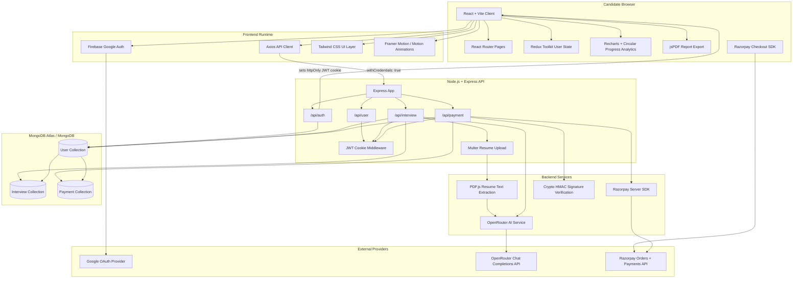

<p align="center">
  
</p>

<h1 align="center">SmartMock.AI</h1>

<p align="center">
  AI-powered mock interviews, performance analytics, PDF reports, and credit-based interview preparation.
</p>

<div align="center">

**🚀 Live Project:** [https://smartmockai-4phv.onrender.com/]

</div>

<p align="center">
  
  
  
  
  
  
</p>

## Project Overview

SmartMock.AI is a full-stack MERN interview preparation platform that helps candidates practice realistic interview scenarios with AI-generated questions, resume-aware prompts, timed answers, automated scoring, and downloadable performance reports.

The platform combines a React/Vite frontend with a Node.js/Express backend, MongoDB persistence, Razorpay-powered credit purchases, and OpenRouter-backed AI evaluation. Users can authenticate with Google, upload resumes, generate tailored technical or HR interview questions, complete timed mock interviews, review detailed analytics, and export structured PDF reports for future preparation.

## System Architecture



## Monorepo Folder Structure

```text
SmartMockAI/
├── README.md
├── backend-setup.md
├── client/
│   ├── README.md
│   ├── package.json
│   ├── vite.config.js
│   ├── public/
│   │   ├── favicon.svg
│   │   └── icons.svg
│   └── src/
│       ├── App.jsx
│       ├── main.jsx
│       ├── index.css
│       ├── assets/
│       ├── components/
│       ├── pages/
│       ├── redux/
│       └── utils/
└── server/
    ├── README.md
    ├── package.json
    ├── server.js
    ├── app.js
    ├── config/
    ├── controllers/
    ├── middlewares/
    ├── models/
    ├── public/
    ├── routes/
    └── services/
```

## High-Level Quick Start

### Prerequisites

- Node.js 20 or newer
- npm
- MongoDB connection string
- Razorpay test or live credentials
- OpenRouter API key
- Firebase project credentials for Google authentication

### Install Both Apps

From the repository root, install frontend and backend dependencies in parallel.

PowerShell:

```powershell
Start-Job { npm --prefix client install }
Start-Job { npm --prefix server install }
Get-Job | Wait-Job | Receive-Job
```

macOS/Linux shell:

```bash
npm --prefix client install & npm --prefix server install & wait
```

### Configure Environment

Create environment files for each app:

```text
client/.env
server/.env
```

See the dedicated READMEs for exact frontend and backend environment variable tables:

- [Client README](client/README.md)
- [Server README](server/README.md)

### Run Locally

Terminal 1:

```bash
cd server
npm run dev
```

Terminal 2:

```bash
cd client
npm run dev
```

The client runs through Vite and talks to the Express API. The backend connects to MongoDB, signs JWT cookies, creates Razorpay orders, verifies payments, and calls the AI provider for resume analysis, question generation, and answer evaluation.

## Contribution Guidelines

Contributions should preserve the project structure and deployment assumptions used by the React/Vite client and Express server.

1. Fork the repository and create a feature branch.
2. Keep frontend changes inside `client/` and backend changes inside `server/` unless the change is intentionally cross-cutting.
3. Run the relevant build or smoke test before opening a pull request.
4. Verify import paths with exact filesystem casing before pushing, especially for Linux deployments.
5. Do not commit `.env`, build artifacts, local logs, uploaded resumes, or private API keys.
6. Document any new route, model field, environment variable, or third-party service in the relevant README.

## License

This project is distributed under the ISC License. Use, modify, and distribute it according to the terms of that license.
